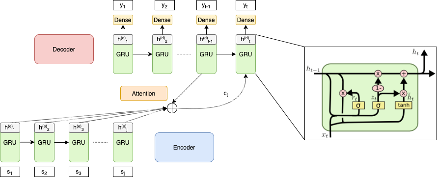
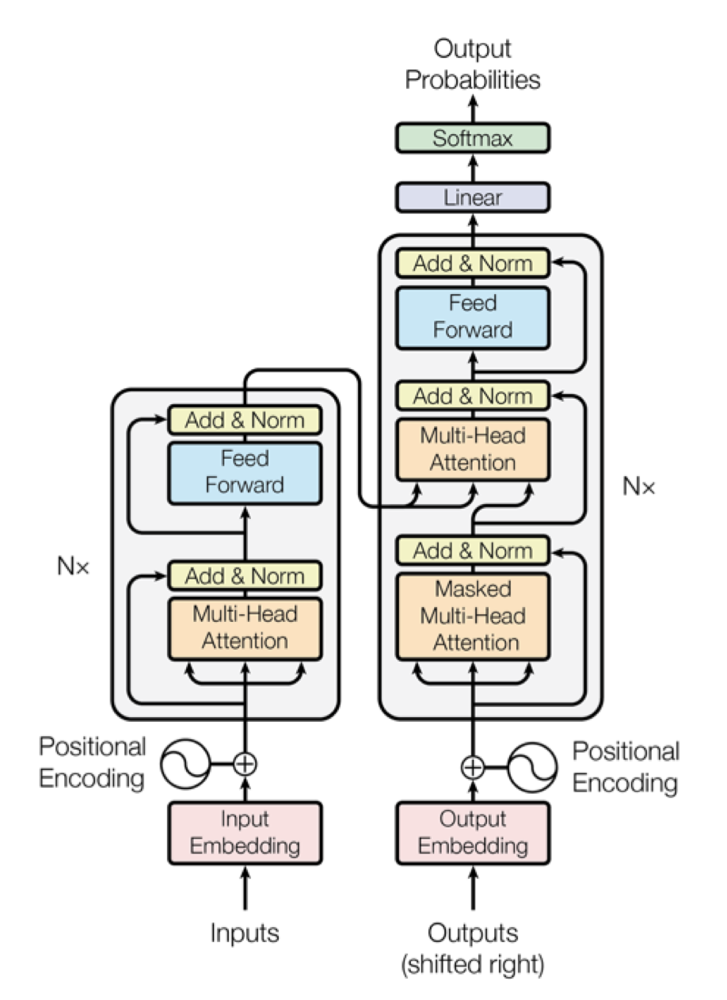

# Notebooks

### [Recurrent Encoder-Decoder Model](https://github.com/SydAnth/thesis-seq2seq/blob/master/Notebooks/RED%20-%20Complete%20Set%20Up.ipynb)

This notebook contains the complete set up of the RED model used in the thesis. All results related to the RED model have been developed with this workbook.
This workbook can be used for both the English as well as the German data set.
However, the default set up is for the English data otherise all references to 
the dataframe "data" have to be replaced with "dataDE".

### [Transformer Model](https://github.com/SydAnth/thesis-seq2seq/blob/master/Notebooks/Transformer%20-%20Complete%20Set%20Up.ipynb)

This notebook contains the complete set up of the Transformer model used in the thesis. 
All results related to the Transformer model have been developed with this workbook. 
This workbook can be used for both the English as well as the German data set.
However, the default set up is for the English data otherise all references to the dataframe "data" have to be replaced with "dataDE".
Furthermore, both greedy search and beam search have been implemented as decoding alogrithms for this workbook.

# Background

