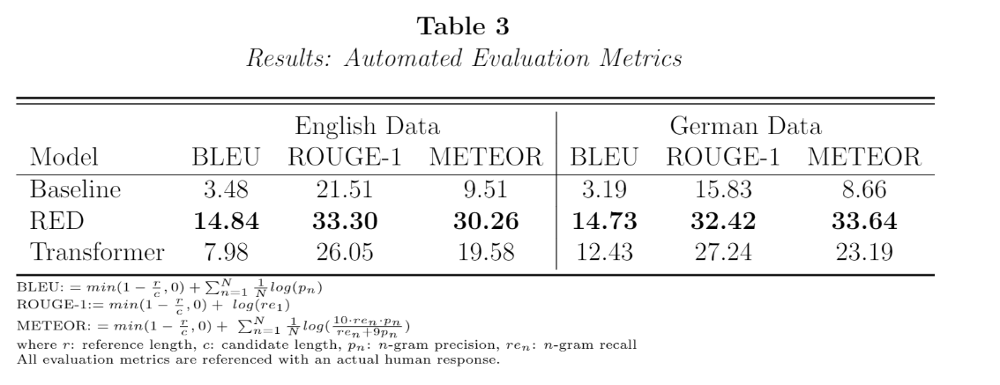

# Background


# Notebooks

### [Recurrent Encoder-Decoder Model](https://github.com/SydAnth/thesis-seq2seq/blob/master/Notebooks/RED-Trained.ipynb)

```python

### Attention is a key concept of recurrent encoder-decoder models

class DotAttention(tf.keras.layers.Layer):
  def __init__(self):
    super(DotAttention, self).__init__()

  def call(self, query, keys , values):
    #query: hidden_state
    #keys: encoder_output
    #values: encoder_output

    # hidden shape == (batch_size, hidden size)
    # hidden_with_time_axis shape == (batch_size, 1, hidden size)
    # we are doing this to perform addition to calculate the score
    query_with_time_axis = tf.expand_dims(query, 1)

    # score shape == (batch_size, max_length, 1)
    # we get 1 at the last axis because we are applying score to self.V
    # the shape of the tensor before applying self.V is (batch_size, max_length, units)
    score = tf.matmul(query_with_time_axis, keys, transpose_b=True)

    score = tf.transpose(score,perm=[0,2,1])
    # attention_weights shape == (batch_size, max_length, 1)
    attention_weights = tf.nn.softmax(score, axis=1)

    # context_vector shape after sum == (batch_size, hidden_size)
    context_vector = attention_weights * values
    context_vector = tf.reduce_sum(context_vector, axis=1)

    return context_vector, attention_weights

```

This notebook contains the complete set up of the RED model used in the thesis. All results related to the RED model have been developed with this workbook.
This workbook can be used for both the English as well as the German data set.
However, the default set up is for the English data otherise all references to 
the dataframe "data" have to be replaced with "dataDE".

### [Transformer Model](https://github.com/SydAnth/thesis-seq2seq/blob/master/Notebooks/Transformer-Trained.ipynb)

```python

### The Transformer builds upon the RED framework but does away with recurrent network structures.

class Transformer(tf.keras.Model):
  def __init__(self, enc_num_layers,dec_num_layers, d_model, num_heads, dff, input_vocab_size, 
               target_vocab_size, pe_input, pe_target, rate=0.1):
    super(Transformer, self).__init__()

    self.encoder = Encoder(enc_num_layers, d_model, num_heads, dff, 
                           input_vocab_size, pe_input, rate)

    self.decoder = Decoder(dec_num_layers, d_model, num_heads, dff, 
                           target_vocab_size, pe_target, rate)

    self.final_layer = tf.keras.layers.Dense(target_vocab_size)
    
  def call(self, inp, tar, training, enc_padding_mask, 
           look_ahead_mask, dec_padding_mask):

    enc_output = self.encoder(inp, training, enc_padding_mask)  # (batch_size, inp_seq_len, d_model)
    
    # dec_output.shape == (batch_size, tar_seq_len, d_model)
    dec_output, attention_weights = self.decoder(
        tar, enc_output, training, look_ahead_mask, dec_padding_mask)
    
    final_output = self.final_layer(dec_output)  # (batch_size, tar_seq_len, target_vocab_size)
    
    return final_output, attention_weights

```

This notebook contains the complete set up of the Transformer model used in the thesis. 
All results related to the Transformer model have been developed with this workbook. 
This workbook can be used for both the English as well as the German data set.
However, the default set up is for the English data otherise all references to the dataframe "data" have to be replaced with "dataDE".
Furthermore, both greedy search and beam search have been implemented as decoding alogrithms for this workbook.

# Outline Results



The overall performance of the neural response frameworks compared to an industry standard baseline can be take from table 3.
All three indices are measured on a scale from 0 to 100 and a higher value aligns with a higher quality response in the sense that it aligns more 
closely with the human generated gold standard reference. For both the English data set as well as the German data set, 
the results show that the both neural models outperform the baseline information retrieval model in all three categories by significant margins. 
Furthermore, the RED model outperforms the Transformer based model where the difference in performance seems to 
be greater in the English data set compared to the German data. The similar performance of all three frameworks across different 
languages indicates that this approach evaluates their actual value for natural language generation and not their performance on a certain data set.


In order to validate the previous results actual customer service agents were asked to evaluate the model output for two criteria. 
First, they were asked whether the produced output was sensible in a manner that the output produced was grammatically correct, 
contained no repetitions and was logically sound. Secondly, agents were asked to ascertain if the output matched the topic of the customer 
enquiry or was specific with regards to the subject matter. Specifically, in 57% of evaluations by customer service experts, the agents agreed that the output generated by the RED model was sensible and 
in more than 60% of evaluations the output was rated as specific to the customer enquiry. 
In the end, the response suggestion from the RED model were rated both specific and sensible in 44% of evaluations.
Moreover, the sensibleness and BLEU criteria are significantly and positively correlated providing some support for the 
argument that the use of automated metrics of linguistic quality in a customer service application is valid.


